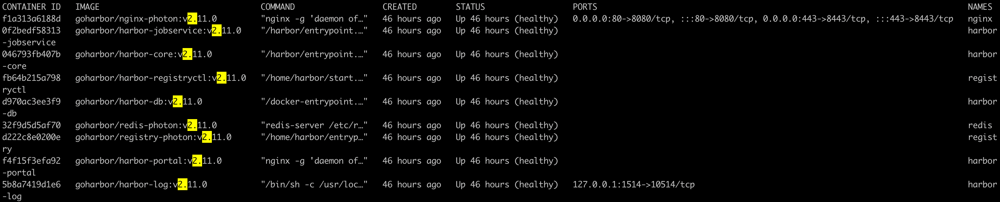
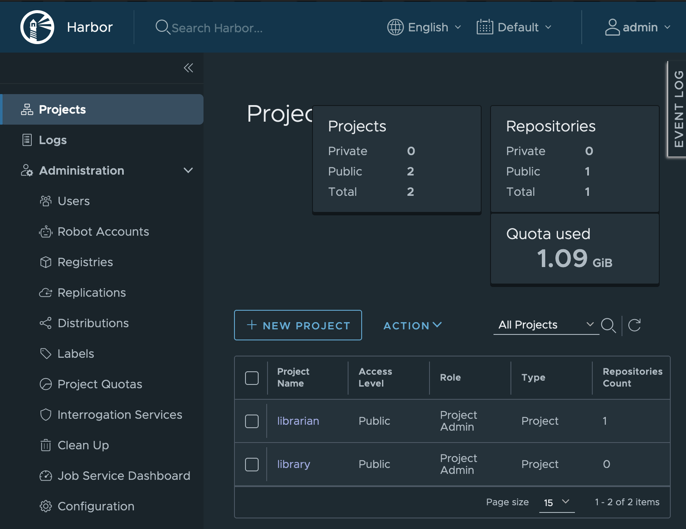

# Triển khai Harbor.

Trong này tôi sẽ triển khai với mô hình gồm 2 vps tách rời.
Tuy nhiên tôi sẽ chỉ tập trung vào Harbor.

- Nginx Server: version 1.24.0 (Đã dựng sẵn)
- Harbor: version 2.11.0

Thông tin hạ tầng đang sử dụng:

* OS: Ubuntu Server 24.04
* python > 2.7
* certbot nginx
* docker, docker-compose

=> Tương tự khi Triển khai Docker Registry, tôi cũng sẽ phải setup config trên Server Nginx, và cài đặt trên vps cho Harbor.
Đối với Server Nginx thì config gần giống bên Docker Registry, chỉ khác là thay vì port 5000, thì sẽ dùng port default 80. Tức là config sẽ tương tự:

```
upstream docker-registry {
   server 192.168.1.3:5000;
}
server {
    listen 80;
    server_name registry.domain.com;
    auth_basic $authentication;
    auth_basic_user_file /etc/nginx/registry.passwd;

    location / {
                if ($http_user_agent ~ "^(docker\/1\.(3|4|5(?!\.[0-9]-dev))|Go ).*$" )  {
                        return 404;
                }
                proxy_pass http://192.168.1.3;

                proxy_set_header  Host              $http_host;
                proxy_set_header  X-Real-IP         $remote_addr;
                proxy_set_header  X-Forwarded-For   $proxy_add_x_forwarded_for;
                proxy_set_header  X-Forwarded-Proto $scheme;
                proxy_read_timeout                  900;
    }
}
```

Lưu ý phần docker-registry mình vẫn giữ nguyên, vì port upstream vẫn là 5000.

Các phần còn lại như config SSL, bạn có thể giữ nguyên config khi cài Docker Registry và chỉ thay đổi phần proxy_pass thôi.

Ngoài ra, hãy lưu lại 2 file Certificate SSL

```
ssl_certificate /etc/letsencrypt/live/registry.domain.com/fullchain.pem; # managed $
ssl_certificate_key /etc/letsencrypt/live/registry.domain.com/privkey.pem; # manage$
```

### Setup trên Harbor vps.

User đang dùng: root (Nếu không dùng user root thì bạn cần đảm bảo user hiện tại được cấp quyền docker, hoặc thêm `sudo` trước mỗi dòng lệnh.

User-Folder: `~/root`

Workspace: `/data`

##### Step 1: Create folder for resource

Bạn cần tạo folder chứa resource và cert để sử dụng trong tài liệu này.

```
mkdir -p /data/harbor-resource

mkdir /data/harbor-data

mkdir /data/harbor-cert
```

Ở đây mình sẽ làm viêc tại trên 3 folder chính

* **harbor-resource**: Chứa resource sẽ clone về máy
* **harbor-data**: Chứa data
* **harbor-cert**: Chứa các file cert

##### Step 2: Xử lý certificate file

Lưu ý: Certificate file SSL là tôi đã general trước từ vps chạy nginx. Bạn có thể làm theo tôi hoặc chép ssl file có sẵn để sử dụng.

Hãy chép file certificate mình nói ở trên vào `/data/cert` này và đảm bảo trong thư mục có 2 file sau nhé:

- fullchain.pem
- privkey.pem

Convert file ssl

```
cd /data/harbor-cert

openssl x509 -in fullchain.pem -out registry.domain.com.crt
openssl rsa -in privkey.pem -out registry.domain.com.key
```

##### Step 3: Tải resource

Tải resource hiện tại về **Workspace**/harbor-resource.

```
cd /data/harbor-resource

git clone https://github.com/anhitvn/Private-Registry.git
```

Và dùng harbor-online trong resource này hoặc bạn tải resource offline với command

```
curl -s https://api.github.com/repos/goharbor/harbor/releases/latest | grep browser_download_url | cut -d '"' -f 4 | grep '\.tgz$' | wget -i -
tar xvzf harbor-offline-installer*.tgz
```

##### Step 4: Cấu hình config cho Harbor

Sau khi giản nén ta sẽ có folder harbor. Ta cần update thông tin trong file config harbor.yaml trong resource

```
cd /data/harbor-resource/harbor
```

Thông tin cần udpate

```
hostname: registry.domain.com
certificate: /data/harbor-cert/registry.domain.com.crt
private_key: /data/harbor-cert/registry.domain.com.key
harbor_admin_password: Harbor_123
password: root_123
data_volume: /data/harbor_data
```

#### Step 5: Setup

```
cd /data/harbor-resource/harbor

./install.sh
```

Sau khi chạy thành công, mình sẽ có 9 container hoạt động.



##### Kết quả:

Truy cập link: `registry.domain.com` để vào trang truy cập.

Bạn cũng có thể truy cập thông qua IP

Khi login thành công sẽ như dưới đây.



##### Các command pull push tag thường sử dụng.

Ví dụ:

```
docker tag anhdh/powdoc registry.domain.com/powdoc:cms.18.2.slim
docker push registry.domain.com/librarian/powdoc:cms.18.2.slim
docker push registry.domain.com/librarian/powdoc:cms.18.2.slim
````

##### Chúc bạn thành công
