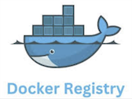
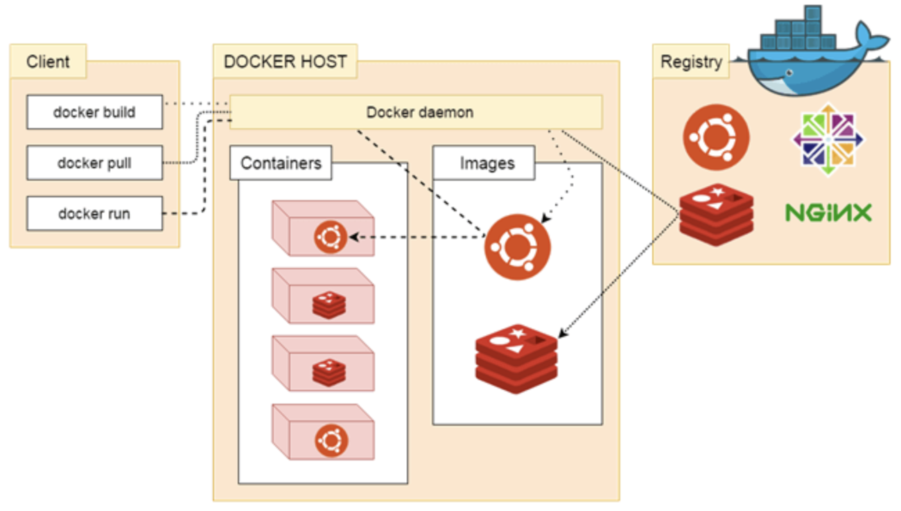

# Setup và config Docker Registry đầy đủ (Gán Domain + SSL)



Đầu tiên mô hình tôi setup sẽ bao gồm 2 VPS riêng biệt như sau.

- Nginx Proxy Server: Sẽ chỉ nói về cách config, general SSL cho Docker Registry. (Không bao gồm setup config cho Nginx)
- Docker Registry

Dưới đây là Map hình ảnh trực quan nhất với Docker Registry


## Bắt đầu triển khai.

Bởi vì tôi sử dụng trên 2 vps riêng biệt nên sẽ có 2 ip cho 2 vps.

* Nginx ở đây với ip: 192.168.1.2
* Registry với ip: 192.168.1.3
  Port default của registry sẽ dùng là: 5000

### I. Docker Registry

Docker Registry version: 2

Tạo thư mục chứa data file và config cho Registry

```
mkdir -p /data/registry
```

Git clone resource về và copy file config vào registry data

```cp ./config.yml /data/registry/config.yml
cp ./config.yml /data/registry/config.yml
```

Tiếp theo thì ta sẽ run registry từ docker-compose file

```docker compose -f registry.yml up -d
docker compose -f registry.yml up -d
```

Để chắc chắn registry đã hoạt động bạn có thể test bằng các lệnh như telnet hoặc docker logs

```
telnet localhost 5000
```

or

```
telnet <IP> 5000
```

or check từ web browser: `http://IP:5000` nếu ra trang trắng thì đã ok

### II. Từ nginx Server

- Nginx version: 1.24.0

Tôi sử dụng nginx ở đây bởi vì tôi config cho registry của mình 1 domain và có SSL để sử dụng bên ngoài Network Local công ty, hoặc sử dụng cho config CICD nếu cần.

Ngoài ra cũng là để set cho private registry 1 basic authen.

Từ nginx mình cần phải tạo cho registry này 1 domain.

Ví dụ ở đây là: registry.domain.com => Hãy thay domain này bằng domain của bạn.
Tôi sẽ tạo file config trong: `/etc/nginx/conf.d/registry.domain.com.conf` với nội dung

```
upstream docker-registry {
   server 192.168.1.3:5000;
}
server {
    listen 80;
    server_name registry.domain.com;
    auth_basic $authentication;
    auth_basic_user_file /etc/nginx/registry.passwd;

    location / {
                if ($http_user_agent ~ "^(docker\/1\.(3|4|5(?!\.[0-9]-dev))|Go ).*$" )  {
                        return 404;
                }
                proxy_pass http://192.168.1.3:5000;

                proxy_set_header  Host              $http_host;
                proxy_set_header  X-Real-IP         $remote_addr;
                proxy_set_header  X-Forwarded-For   $proxy_add_x_forwarded_for;
                proxy_set_header  X-Forwarded-Proto $scheme;
                proxy_read_timeout                  900;
    }
}
```

Tôi sẽ dùng certbot nginx đê general SSL

```
certbot --nginx -d registry.domain.com
```

Sau khi general SSL xong thì file registry.domain.com.conf sẽ là:

```
upstream docker-registry {
   server 192.168.1.3:5000;
}
server {
    server_name registry.domain.com;
# Basic Authen
    auth_basic $authentication;
    auth_basic_user_file /etc/nginx/registry.passwd;

    location / {
                if ($http_user_agent ~ "^(docker\/1\.(3|4|5(?!\.[0-9]-dev))|Go ).*$" )  {
                        return 404;
                }
                proxy_pass https://192.168.1.3:5000;

                proxy_set_header  Host              $http_host;
                proxy_set_header  X-Real-IP         $remote_addr;
                proxy_set_header  X-Forwarded-For   $proxy_add_x_forwarded_for;
                proxy_set_header  X-Forwarded-Proto $scheme;
                proxy_read_timeout                  900;
    }
    listen 443 ssl; # managed by Certbot
    ssl_certificate /etc/letsencrypt/live/registry.domain.com/fullchain.pem; # managed $
    ssl_certificate_key /etc/letsencrypt/live/registry.domain.com/privkey.pem; # manage$
    include /etc/letsencrypt/options-ssl-nginx.conf; # managed by Certbot
    ssl_dhparam /etc/letsencrypt/ssl-dhparams.pem; # managed by Certbot

}
server {
   server_name registry.domain.com;
   listen 80;
   return 301 https://$host$request_uri;
}

```

File: `/etc/nginx/registry.passwd` sẽ lưu trữ tài khoản login cho Registry.
Run các command để tạo file và set account basic authentication cho Registry

```
touch /etc/nginx/registry.passwd
cd /etc/nginx/
htpasswd -Bc registry.passwd anhitvn
```

Trong trường hợp bạn không dùng được lệnh htpasswd thì có lẽ nginx của bạn chưa có lib hỗ trợ tệp lệnh này. Hãy cài nó.

```
apt-get -y install apache2-utils
```

## Test và push pull image đầu tiên

##### Test thủ login trên terminal

```
docker login registry.domain.com
```

Ra dòng như dưới đây là ok nhé.

```
Authenticating with existing credentials...
Login Succeeded
```

##### Test thử pull push

Pull image từ Docker hub

```
docker pull ubuntu:18.04
```

Đánh Tag image hoặc nếu có image mẫu cũng có thể tag

```
docker tag ubuntu:18.04 registry.domain.com/ubuntu:18.04
```

Đẩy image lên

```
docker push registry.domain.com/ubuntu:18.04
```

Lấy image từ Private Registry về.

```
docker pull registry.domain.com/ubuntu:18.04
```

##### Cách lệnh kiểm tra image trên Private Registry

```
curl https://registry.domain.com/v2/_catalog
curl https://registry.domain.com/v2/ubuntu/tags/list
```


Xong rồi.

Chuc may mắn
